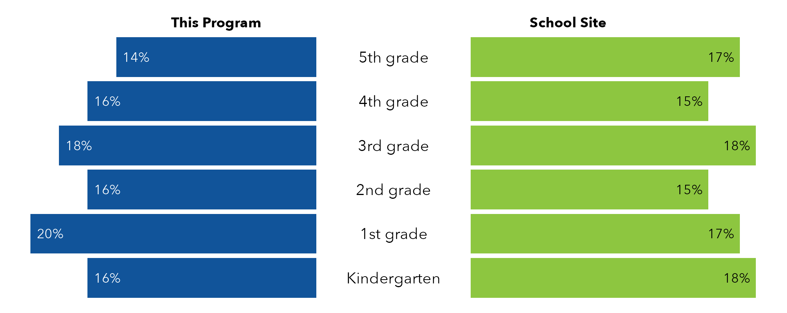
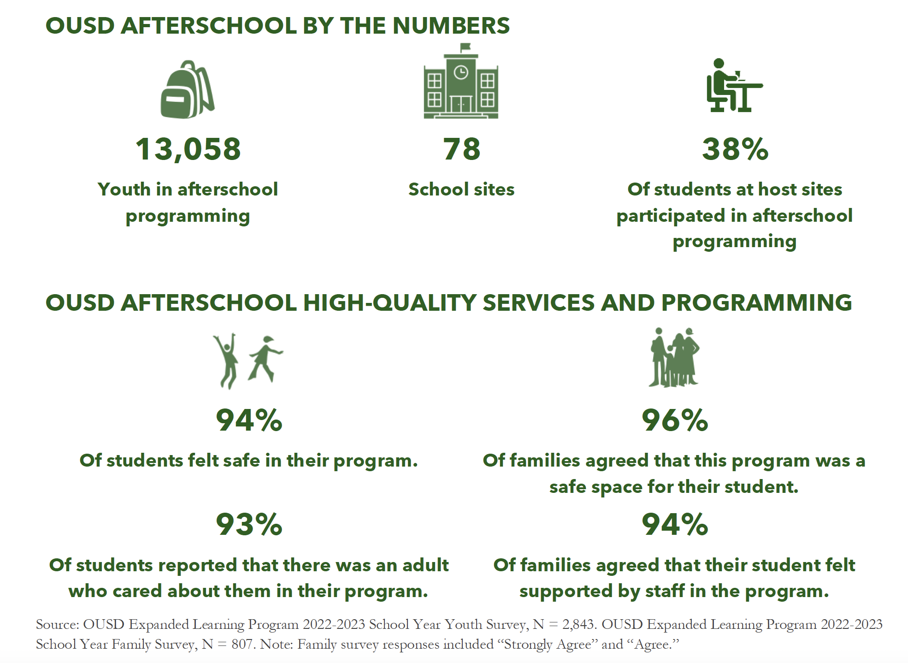
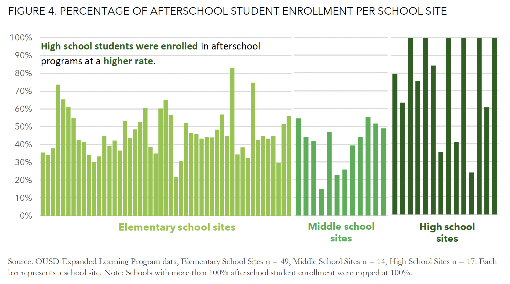
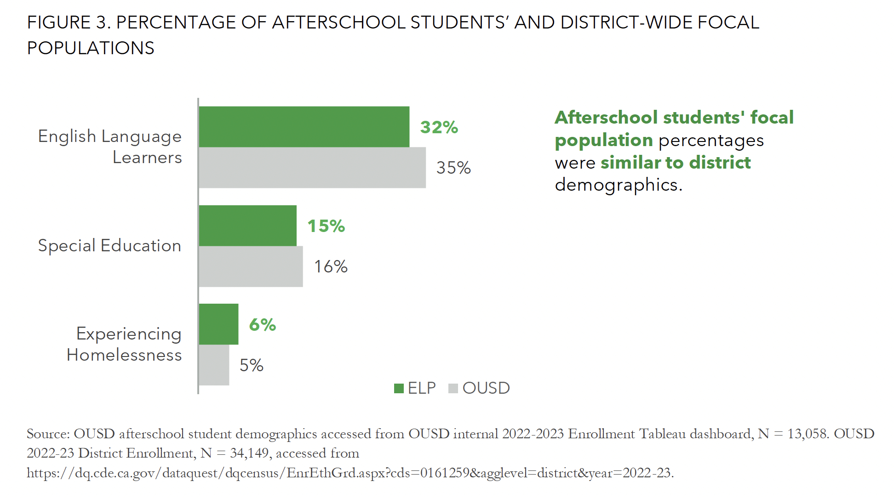

## Context

This is a publicly-available report similar to one I worked on as an intern at [Public Profit](https://www.publicprofit.net/). Below, I describe some aspects of the report that I worked on, and discuss what I did in general terms. 

The goal of this project was to first generate school-level reports for each of the ~79 school sites served by afterschool programs, and then aggregate to the district-level in an overall report. You can read the publicly-available example of a similar overall report [here](https://resources.finalsite.net/images/v1718048290/ousdorg/q7mcejnju0fpx3pnd6t0/2022-23OUSDAfterschoolEvaluation_FINAL.pdf). 

I worked on this project alongside the other members of the project team at Public Profit. I was responsible for analyzing data for the sections that provided demographic and enrollment information. 

## Site Reports

I used [parameterized reporting](https://book.rfortherestofus.com/parameterized-reporting) to create a site-level report for each school in the dataset. Before doing so, I cleaned the demographics and enrollment data that Public Profit received from the school district. I used functions from the `janitor` and `tidyverse` packages to import the data from Excel to R, clean up the variable names, and merge it with a key that the project team created to ensure that each school's name in the report was the name version that the client wanted. Creating the key required some detective work because school names had different iterations across contexts: for example, a school could be called "Elmhurst Elementary" in one place but "Elmhurst Elementary School" in another. 

I then used `group_by()` and `summarize()` functions to aggregate across grade levels within each school and calculate enrollment, average daily attendance, and demgraphics for each schol. 

Then, using parameterized reporting, I generated a Word document summarizing this data and comparing demographics from students in the afterschool program to all the students within that school. I used functions from `flextable`, `officer`, and `officedown` to create nicely formatted tables in Word. I also used `ggplot` to create the pyramid chart shown below, which compares the percentage of students in each grade who participated in the afterschool program (blue) to the overall school site (green). Because schools varied in the number of grades they served, I coded the chart so that the size of the bars would change dynamically but the overall size of the chart stayed the same, so that it would always fit on the first page of each report. 

## Overall Report

After working on the site reports, I then aggreggated the data to the overall district level. Whereas the project team had already established with the client which metrics would go into the site reports, I was given a lot of freedom to explore the overall dataset and identify trends that would be valuable to report.

I first generated an overall summary including the number of students served by afterschool programs, the number of school sites, and the percentage of students at host sites who participated in afterschool programs.

I then exported the data from R to Excel to create visualizations similar to the following charts (these are included in the example report linked above). I used sparklines in Excel to identify interesting trends across sites. I found that, as shown in the chart below, students at high schools seemed to be enrolled in afterschool programs at a higher rate than students in elementary or middle schools. 

Providing evidence that afterschool programs had a positive impact on students' academic outcomes, I also found that students who participated in afterschool programs had higher school day attendance rates than students who didn't participate, across almost every school site. 

Finally, the percentage of afterschool program students in the school district's "focal popuations" (in other words, populations of particular interest) was similar to the percentages in the district overall, suggesting that the programs were adequately serving these populations. 

I aimed to make these visualizations easily understandable to a wide audience, by focusing on clean lines, reducing unnecessary clutter, using color strategically to highlight the most important datapoints, and including a clear 'story' or takeaway for each chart. 

You can check out the full version of a similar report [here](https://resources.finalsite.net/images/v1718048290/ousdorg/q7mcejnju0fpx3pnd6t0/2022-23OUSDAfterschoolEvaluation_FINAL.pdf). The exact report I worked on is not publicly available, but I used content from that example to illustrate this description of the project that I worked on. 